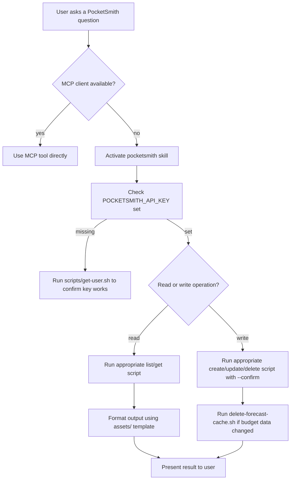

# PocketSmith Skill — Design Document

This document captures everything needed to build the `pocketsmith` Agent Skill. It is the single source of truth before implementation begins.

---

## 1. Required Skill Structure (from agentskills.io specification)

### Directory layout

```
pocketsmith/
├── SKILL.md              # Required: YAML frontmatter + instructions
├── scripts/              # Shell scripts — one per major operation
├── references/           # On-demand reference docs (progressive disclosure)
└── assets/               # Templates, output format templates
```

### `SKILL.md` frontmatter rules

| Field         | Required | Constraint |
|---------------|----------|------------|
| `name`        | yes      | `pocketsmith` — matches directory; 1–64 chars; `[a-z0-9-]`; no edge/consecutive hyphens |
| `description` | yes      | ≤1024 chars; third-person; states **what + when** with trigger keywords |
| `license`     | no       | MIT (repo licence) |
| `compatibility` | no     | ≤500 chars; include if env requirements exist |
| `metadata`    | no       | Flat string→string map |

### Body rules

- ≤500 lines / ≤5000 tokens recommended.
- Step-by-step instructions only; no preamble or filler.
- Large reference material → `references/`; link with `when to load` cue.
- Scripts referenced by relative path from skill root.
- Progressive disclosure: body = core workflow; details = on-demand files.

---

## 2. PocketSmith API Endpoints (grouped by category)

Base URL: `https://api.pocketsmith.com/v2`  
Authentication: `X-Developer-Key` header (API key)

### Users

| Method | Endpoint | Description |
|--------|----------|-------------|
| GET | `/me` | Get the authorised user |
| GET | `/users/{id}` | Get user by ID |
| PUT | `/users/{id}` | Update user |

### Institutions

| Method | Endpoint | Description |
|--------|----------|-------------|
| GET | `/institutions/{id}` | Get institution |
| PUT | `/institutions/{id}` | Update institution |
| DELETE | `/institutions/{id}` | Delete institution |
| GET | `/users/{id}/institutions` | List institutions in user |
| POST | `/users/{id}/institutions` | Create institution in user |

### Accounts

| Method | Endpoint | Description |
|--------|----------|-------------|
| GET | `/accounts/{id}` | Get account |
| PUT | `/accounts/{id}` | Update account |
| DELETE | `/accounts/{id}` | Delete account |
| GET | `/users/{id}/accounts` | List accounts in user |
| PUT | `/users/{id}/accounts` | Update display order of accounts |
| POST | `/users/{id}/accounts` | Create account in user |
| GET | `/institutions/{id}/accounts` | List accounts in institution |

### Transaction Accounts

| Method | Endpoint | Description |
|--------|----------|-------------|
| GET | `/transaction-accounts/{id}` | Get transaction account |
| PUT | `/transaction-accounts/{id}` | Update transaction account |
| GET | `/users/{id}/transaction-accounts` | List transaction accounts in user |

### Transactions

| Method | Endpoint | Description |
|--------|----------|-------------|
| GET | `/transactions/{id}` | Get a transaction |
| PUT | `/transactions/{id}` | Update a transaction |
| DELETE | `/transactions/{id}` | Delete transaction |
| GET | `/users/{id}/transactions` | List transactions in user |
| GET | `/accounts/{id}/transactions` | List transactions in account |
| GET | `/categories/{id}/transactions` | List transactions in category |
| GET | `/transaction-accounts/{id}/transactions` | List transactions in transaction account |
| POST | `/transaction-accounts/{id}/transactions` | Create a transaction in transaction account |

### Categories

| Method | Endpoint | Description |
|--------|----------|-------------|
| GET | `/categories/{id}` | Get category |
| PUT | `/categories/{id}` | Update category |
| DELETE | `/categories/{id}` | Delete category |
| GET | `/users/{id}/categories` | List categories in user |
| POST | `/users/{id}/categories` | Create category in user |

### Category Rules

| Method | Endpoint | Description |
|--------|----------|-------------|
| GET | `/users/{id}/category-rules` | List category rules in user |
| POST | `/categories/{id}/category-rules` | Create category rule in category |

### Budgeting

| Method | Endpoint | Description |
|--------|----------|-------------|
| GET | `/users/{id}/budget` | List budget for user |
| GET | `/users/{id}/budget-summary` | Get budget summary for user |
| GET | `/users/{id}/trend-analysis` | Get trend analysis for user |
| DELETE | `/users/{id}/forecast-cache` | Delete forecast cache for user |

### Events (Budget Forecast Events)

| Method | Endpoint | Description |
|--------|----------|-------------|
| GET | `/events/{id}` | Get event |
| PUT | `/events/{id}` | Update event |
| DELETE | `/events/{id}` | Delete event |
| GET | `/users/{id}/events` | List events in user |
| GET | `/scenarios/{id}/events` | List events in scenario (params: `start_date`, `end_date`) |
| POST | `/scenarios/{id}/events` | Create event in scenario |

### Attachments

| Method | Endpoint | Description |
|--------|----------|-------------|
| GET | `/attachments/{id}` | Get attachment |
| PUT | `/attachments/{id}` | Update attachment |
| DELETE | `/attachments/{id}` | Delete attachment |
| GET | `/users/{id}/attachments` | List attachments in user |
| POST | `/users/{id}/attachments` | Create attachment in user |
| GET | `/transactions/{id}/attachments` | List attachments in transaction |
| POST | `/transactions/{id}/attachments` | Assign attachment to transaction |
| DELETE | `/transactions/{transaction_id}/attachments/{attachment_id}` | Unassign attachment from transaction |

### Labels

| Method | Endpoint | Description |
|--------|----------|-------------|
| GET | `/users/{id}/labels` | List labels in user |

### Saved Searches

| Method | Endpoint | Description |
|--------|----------|-------------|
| GET | `/users/{id}/saved-searches` | List saved searches in user |

### Currencies

| Method | Endpoint | Description |
|--------|----------|-------------|
| GET | `/currencies` | List currencies |
| GET | `/currencies/{id}` | Get currency |

### Time Zones

| Method | Endpoint | Description |
|--------|----------|-------------|
| GET | `/time-zones` | List time zones |

---

## 3. MCP Server Tools (all 57, grouped by category)

Server URLs:
- **Full access (57 tools):** `https://mcp.pocketsmith.com/mcp`
- **Read-only (38 tools):** `https://mcp-readonly.pocketsmith.com/mcp`

Authentication: OAuth 2.0 with PKCE (auto-handled by MCP clients)

### Insights — compound analysis tools (read-only)

| Tool | What it does |
|------|-------------|
| `financial_health_snapshot` | Net worth, spending pace, budget traffic lights, action items |
| `month_end_review` | Full period review: income/expenses, savings rate, budget variance, top payees |
| `spending_comparison` | Side-by-side comparison of two date periods by category and payee |
| `find_recurring_expenses` | Detect subscriptions and recurring bills with annual cost totals |
| `cash_flow_forecast` | Forward-looking account balance projections with danger-zone alerts |
| `net_worth_forecast` | Net worth trajectory with historical trend, forecast, and milestone projections |
| `forecast_accuracy` | Compare actual vs forecast balances to evaluate budget reliability |

### Budgeting (read + write)

| Tool | Access | What it does |
|------|--------|-------------|
| `get_budget` | read | Budget analysis per category for the forecast period |
| `get_budget_summary` | read | Expense/income actuals vs budgeted for a date range |
| `get_trend_analysis` | read | Spending trends over time by category |
| `delete_forecast_cache` | write | Force budget recalculation after bulk edits |

### Transactions (read + write)

| Tool | Access | What it does |
|------|--------|-------------|
| `list_transactions` | read | Search and filter transactions by date, category, keyword, status |
| `get_transaction` | read | Get a single transaction's full details |
| `create_transaction` | write | Add a new transaction |
| `update_transaction` | write | Edit a transaction (payee, category, labels, notes, splits) |
| `delete_transaction` | write | Remove a transaction |

### Accounts & Institutions (read + write)

| Tool | Access | What it does |
|------|--------|-------------|
| `list_accounts` | read | List all accounts by user or institution |
| `get_account` | read | Get account details including balance and child accounts |
| `create_account` | write | Create a new account |
| `update_account` | write | Update an account |
| `delete_account` | write | Delete an account |
| `update_account_display_order` | write | Reorder accounts |
| `list_institutions` | read | View financial institutions |
| `get_institution` | read | Get institution details |
| `create_institution` | write | Create an institution |
| `update_institution` | write | Update an institution |
| `delete_institution` | write | Delete an institution |
| `list_transaction_accounts` | read | List transaction accounts |
| `get_transaction_account` | read | Get transaction account details |
| `update_transaction_account` | write | Update a transaction account |

### Categories & Rules (read + write)

| Tool | Access | What it does |
|------|--------|-------------|
| `list_categories` | read | View full category hierarchy |
| `get_category` | read | Get a single category |
| `create_category` | write | Create a new category |
| `update_category` | write | Update a category |
| `delete_category` | write | Delete a category |
| `list_category_rules` | read | View auto-categorisation rules |
| `create_category_rule` | write | Create an auto-categorisation rule |

### Budget Events (read + write)

| Tool | Access | What it does |
|------|--------|-------------|
| `list_events` | read | View budget forecast events |
| `get_event` | read | Get a single budget event |
| `create_event` | write | Create a recurring or one-off budget event |
| `update_event` | write | Update a budget event |
| `delete_event` | write | Delete a budget event |

### Attachments (read + write)

| Tool | Access | What it does |
|------|--------|-------------|
| `list_attachments` | read | View receipt and document attachments |
| `get_attachment` | read | Get a single attachment |
| `create_attachment` | write | Upload an attachment |
| `update_attachment` | write | Update an attachment |
| `delete_attachment` | write | Delete an attachment |
| `assign_transaction_attachment` | write | Link an attachment to a transaction |
| `unassign_transaction_attachment` | write | Unlink an attachment from a transaction |

### Data Feeds (read + write)

| Tool | Access | What it does |
|------|--------|-------------|
| `get_data_feeds_connection_status` | read | Check bank feed sync status and provider details |
| `refresh_data_feeds_connection` | write | Trigger a sync for one or all bank feed connections |

### Other (read + write)

| Tool | Access | What it does |
|------|--------|-------------|
| `get_current_user` | read | View user profile and settings |
| `update_user` | write | Update user profile and settings |
| `list_labels` | read | View all transaction labels |
| `list_saved_searches` | read | View saved transaction search filters |
| `list_currencies` | read | Currency reference data |
| `get_currency` | read | Get a single currency |
| `list_time_zones` | read | Time zone reference data |

**Read-only tool count: 38** (all tools marked "read" above)  
**Full-access tool count: 57** (adds the 19 write tools)

---

## 4. Data Model Hierarchy

```
Institution (e.g. "Sample Bank")
  └── Account (container/group, e.g. "Everyday Credit Card")
        ├── Transaction Account  ← holds actual transaction records
        └── Scenario             ← holds budget forecast events (drives forecasting engine)

Categories  ← hierarchical parent/child; shared across all accounts
Labels      ← tags on transactions for flexible grouping
```

---

## 5. Proposed Skill Directory Structure

```
pocketsmith/
├── SKILL.md
├── scripts/
│   ├── get-user.sh                     # GET /me (current user profile)
│   ├── list-accounts.sh                # GET /users/{id}/accounts
│   ├── get-account.sh                  # GET /accounts/{id}
│   ├── list-transaction-accounts.sh    # GET /users/{id}/transaction-accounts
│   ├── list-transactions.sh            # GET /users/{id}/transactions (with filters)
│   ├── get-transaction.sh              # GET /transactions/{id}
│   ├── create-transaction.sh           # POST /transaction-accounts/{id}/transactions
│   ├── update-transaction.sh           # PUT /transactions/{id}
│   ├── delete-transaction.sh           # DELETE /transactions/{id}
│   ├── list-categories.sh              # GET /users/{id}/categories
│   ├── get-budget.sh                   # GET /users/{id}/budget
│   ├── get-budget-summary.sh           # GET /users/{id}/budget-summary
│   ├── get-trend-analysis.sh           # GET /users/{id}/trend-analysis
│   ├── list-events.sh                  # GET /users/{id}/events
│   ├── create-event.sh                 # POST /scenarios/{id}/events
│   ├── update-event.sh                 # PUT /events/{id}
│   ├── delete-event.sh                 # DELETE /events/{id}
│   ├── list-institutions.sh            # GET /users/{id}/institutions
│   └── delete-forecast-cache.sh        # DELETE /users/{id}/forecast-cache
├── references/
│   ├── api-endpoints.md                # Full endpoint reference (this doc section 2)
│   ├── mcp-tools.md                    # Full MCP tools reference (this doc section 3)
│   ├── data-model.md                   # PocketSmith hierarchy explanation
│   ├── auth.md                         # API key setup + OAuth notes
│   └── error-codes.md                  # Common HTTP error codes and meanings
└── assets/
    ├── transaction-output-template.md  # Markdown table format for transaction lists
    └── budget-report-template.md       # Markdown format for budget summaries
```

---

## 6. Shell Scripts — Detailed Plan

All scripts:
- POSIX-compatible `sh`
- Accept all input via flags or env vars (no interactive prompts)
- Output structured JSON to stdout; diagnostics to stderr
- Support `--help` flag
- Use `POCKETSMITH_API_KEY` env var (or `--api-key` flag)
- Use `POCKETSMITH_USER_ID` env var (or `--user-id` flag) where needed
- Return meaningful exit codes: `0` success, `1` API/HTTP error, `2` missing args

### `scripts/get-user.sh`
```
Usage: get-user.sh [--api-key KEY]
Calls GET /me. Returns current user profile as JSON.
Env: POCKETSMITH_API_KEY
```

### `scripts/list-accounts.sh`
```
Usage: list-accounts.sh [--api-key KEY] [--user-id ID]
Calls GET /users/{id}/accounts. Returns JSON array of accounts.
Env: POCKETSMITH_API_KEY, POCKETSMITH_USER_ID
```

### `scripts/get-account.sh`
```
Usage: get-account.sh --account-id ID [--api-key KEY]
Calls GET /accounts/{id}. Returns single account JSON.
```

### `scripts/list-transaction-accounts.sh`
```
Usage: list-transaction-accounts.sh [--api-key KEY] [--user-id ID]
Calls GET /users/{id}/transaction-accounts.
```

### `scripts/list-transactions.sh`
```
Usage: list-transactions.sh [--api-key KEY] [--user-id ID]
  [--start-date YYYY-MM-DD] [--end-date YYYY-MM-DD]
  [--search KEYWORD] [--category-id ID]
  [--type uncategorised|debit|credit]
  [--per-page N] [--page N]
Calls GET /users/{id}/transactions with query params.
```

### `scripts/get-transaction.sh`
```
Usage: get-transaction.sh --transaction-id ID [--api-key KEY]
Calls GET /transactions/{id}.
```

### `scripts/create-transaction.sh`
```
Usage: create-transaction.sh --transaction-account-id ID
  --date YYYY-MM-DD --amount FLOAT --payee NAME
  [--note TEXT] [--category-id ID] [--api-key KEY]
Calls POST /transaction-accounts/{id}/transactions.
```

### `scripts/update-transaction.sh`
```
Usage: update-transaction.sh --transaction-id ID
  [--payee NAME] [--category-id ID] [--note TEXT]
  [--labels "tag1,tag2"] [--api-key KEY]
Calls PUT /transactions/{id} with JSON body of provided fields.
```

### `scripts/delete-transaction.sh`
```
Usage: delete-transaction.sh --transaction-id ID [--api-key KEY] [--confirm]
Calls DELETE /transactions/{id}. Requires --confirm flag.
```

### `scripts/list-categories.sh`
```
Usage: list-categories.sh [--api-key KEY] [--user-id ID]
Calls GET /users/{id}/categories. Returns hierarchical category JSON.
```

### `scripts/get-budget.sh`
```
Usage: get-budget.sh [--api-key KEY] [--user-id ID]
Calls GET /users/{id}/budget.
```

### `scripts/get-budget-summary.sh`
```
Usage: get-budget-summary.sh [--api-key KEY] [--user-id ID]
  --start-date YYYY-MM-DD --end-date YYYY-MM-DD
  [--roll-up true|false]
Calls GET /users/{id}/budget-summary.
```

### `scripts/get-trend-analysis.sh`
```
Usage: get-trend-analysis.sh [--api-key KEY] [--user-id ID]
  --period YYYY-MM --num-periods N
  [--categories "id1,id2"]
Calls GET /users/{id}/trend-analysis.
```

### `scripts/list-events.sh`
```
Usage: list-events.sh [--api-key KEY] [--user-id ID]
  [--start-date YYYY-MM-DD] [--end-date YYYY-MM-DD]
Calls GET /users/{id}/events.
```

### `scripts/create-event.sh`
```
Usage: create-event.sh --scenario-id ID
  --start-date YYYY-MM-DD --end-date YYYY-MM-DD (or --repeat-type)
  --amount FLOAT --category-id ID
  [--note TEXT] [--repeat-type weekly|monthly|...] [--api-key KEY]
Calls POST /scenarios/{id}/events.
```

### `scripts/update-event.sh`
```
Usage: update-event.sh --event-id ID
  [--start-date DATE] [--end-date DATE] [--amount FLOAT]
  [--repeat-type TYPE] [--note TEXT] [--api-key KEY]
Calls PUT /events/{id}.
```

### `scripts/delete-event.sh`
```
Usage: delete-event.sh --event-id ID [--api-key KEY] [--confirm]
Calls DELETE /events/{id}. Requires --confirm flag.
```

### `scripts/list-institutions.sh`
```
Usage: list-institutions.sh [--api-key KEY] [--user-id ID]
Calls GET /users/{id}/institutions.
```

### `scripts/delete-forecast-cache.sh`
```
Usage: delete-forecast-cache.sh [--api-key KEY] [--user-id ID] [--confirm]
Calls DELETE /users/{id}/forecast-cache. Forces budget recalculation.
Requires --confirm flag.
```

---

## 7. `SKILL.md` Full Content Plan

### Frontmatter

```yaml
---
name: pocketsmith
description: >
  Queries and manages PocketSmith personal finance data via the PocketSmith API v2.
  Use when the user asks about their finances, bank accounts, transactions, budgets,
  categories, spending trends, budget events, forecasts, or net worth in PocketSmith.
  Provides read operations (list/get accounts, transactions, budgets, categories,
  events, labels, institutions) and write operations (create/update/delete
  transactions, events, categories). Use when the user mentions PocketSmith, wants
  to review spending, categorise transactions, check budget status, or manage
  financial forecasts.
license: MIT
compatibility: Requires curl and internet access. Set POCKETSMITH_API_KEY env var (or pass --api-key). POCKETSMITH_USER_ID recommended.
metadata:
  author: Keith Patton
  author_id: github.com/kaipee
  version: "1.0"
  api_version: v2
  api_base: https://api.pocketsmith.com/v2
---
```

### Body Sections

1. **Setup** — How to get an API key (link to PocketSmith settings), set env vars, get user ID via `scripts/get-user.sh`.

2. **Data model quick reference** — One-paragraph hierarchy summary (Institution → Account → Transaction Account / Scenario). Link to [`references/data-model.md`](references/data-model.md) for full detail.

3. **Common workflows** — Numbered checklists for:
   - Review current month budget
   - Find and categorise uncategorised transactions
   - Add a manual transaction
   - Create a budget event
   - Get spending trends

4. **Available scripts** — Table: script name | purpose | key flags. One line per script.

5. **Gotchas** — Concise bullet list:
   - User ID ≠ API key; fetch it first with `get-user.sh`.
   - Transaction accounts ≠ accounts; transactions live in transaction accounts.
   - Budget events live in scenarios (child of accounts); use scenario ID for POST.
   - After bulk transaction edits, run `delete-forecast-cache.sh` to force recalculation.
   - Dates must be `YYYY-MM-DD` format in all endpoints.
   - `DELETE /forecast-cache` is safe — it only clears the cache, not data.

6. **Error handling** — One-liner: read [`references/error-codes.md`](references/error-codes.md) if API returns non-200.

7. **MCP alternative** — One-liner: if an MCP-enabled client is available, prefer MCP tools (see [`references/mcp-tools.md`](references/mcp-tools.md)) for richer compound analysis.

---

## 8. References Files — Content Plan

### `references/api-endpoints.md`
Full endpoint table from Section 2 above (copy verbatim). Load when: constructing a curl call not covered by a bundled script.

### `references/mcp-tools.md`
Full MCP tools table from Section 3 above. Load when: user is on a Claude.ai / Claude Desktop / Claude Code client and MCP is available.

### `references/data-model.md`
Expanded explanation of Institution → Account → Transaction Account → Scenario hierarchy with examples. Load when: user asks about account structure or scenario/event relationships.

### `references/auth.md`
Step-by-step: get API key from PocketSmith settings, set env var, OAuth notes for MCP. Load when: user needs setup help.

### `references/error-codes.md`
Table of HTTP status codes from PocketSmith API (200, 403, 404, 422, 429, 500) with meanings and recommended actions. Load when: API returns a non-200 response.

---

## 9. Assets Files — Content Plan

### `assets/transaction-output-template.md`
Markdown table template for displaying transaction search results:
```
| Date | Payee | Amount | Category | Labels | Notes |
|------|-------|--------|----------|--------|-------|
```

### `assets/budget-report-template.md`
Markdown template for budget summaries:
```
## Budget Summary: {period}
| Category | Budgeted | Actual | Variance | Status |
|----------|----------|--------|----------|--------|
```

---

## 10. Implementation Notes

- **All scripts POSIX sh** — no bash-isms; run on macOS zsh and Linux sh.
- **`jq` optional** — scripts output raw curl JSON by default; if `jq` is present, pretty-print automatically.
- **Idempotency** — create scripts check for conflicts; delete scripts require `--confirm`.
- **Pagination** — `list-transactions.sh` supports `--page` and `--per-page`; default `--per-page 100`.
- **Dry-run** — write scripts support `--dry-run` to print the curl command without executing.
- **Token count** — `SKILL.md` body target: ≤300 lines, ≤3000 tokens. All detail in `references/`.

---

## 11. Mermaid — Skill Activation Flow



---

## 12. Validation Checklist (pre-implementation)

- [ ] Directory name `pocketsmith` matches `name` in frontmatter.
- [ ] `description` ≤1024 chars, third-person, trigger keywords present.
- [ ] `compatibility` ≤500 chars.
- [ ] `SKILL.md` body ≤500 lines.
- [ ] Each script has `--help`, POSIX-compatible, no interactive prompts.
- [ ] Delete/destructive scripts require `--confirm` flag.
- [ ] Reference files are focused and loaded on-demand with explicit cues in `SKILL.md`.
- [ ] `pocketsmith/` is a sibling of `skill-builder/`, not nested inside it.
